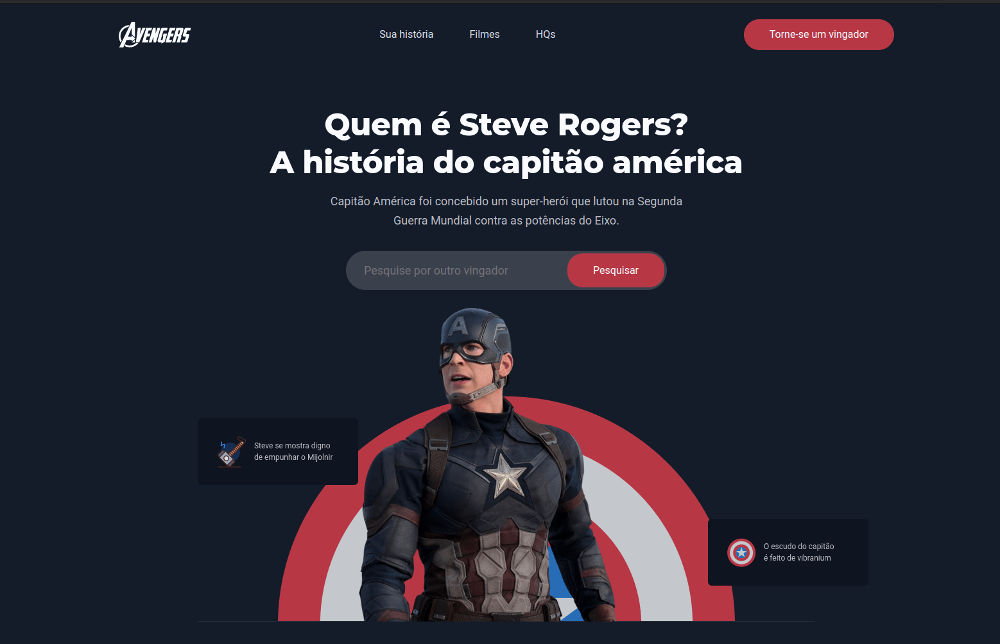

# Landing Page - Capitão America

Landing page desenvolvida para praticar meus conhecimentos em HTML e CSS.
Também utilizei um pouco de animações nas imagens com keyframes e a biblioteca AOS.JS para animações dos textos. 

- Link do projeto em produção: https://ander0308.github.io/captain/

## Tecnologias utilizadas no projeto:
- HTML5
- Css
- Javascript
- Biblioteca Aos.js

  

- Creditos do design para Laryssa Dias (https://www.linkedin.com/in/laryssa-dias)
